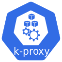
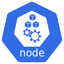
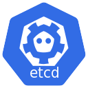
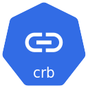
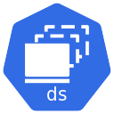
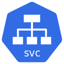
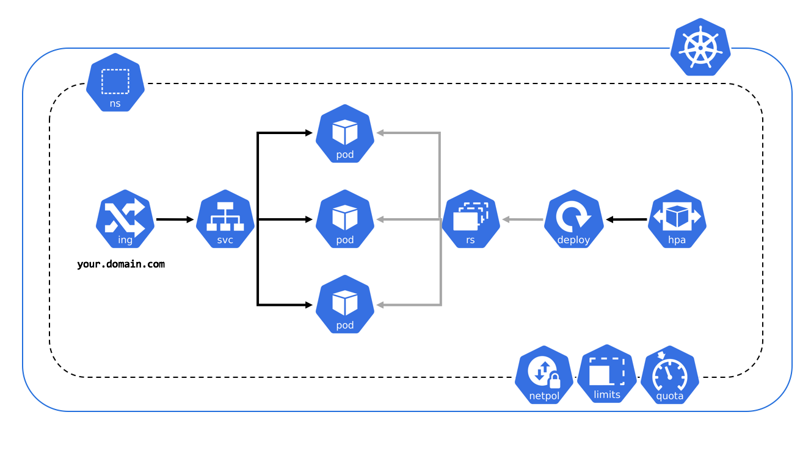

# Kubernetes Icons Set

These icons are a way to standardize Kubernetes architecture diagrams for presentation. Having uniform architecture diagrams improve understandibility.

## Tools

```shell
./tools/update-everything.sh
```

This script generates png from svg, and Visio Stencil from png.

### Generate png icons from svg

```shell
./tools/rasterize.sh
```

This script will convert all svg into png. It's based on a docker container defined [here](hack/svgconvertor/Dockefile)

### Generate Visio Stencil from png icons

```shell
./tools/update-visio.sh
```

This script will convert png icons into Visio stencil using project from [here](https://github.com/hoveytechllc/visio-stencil-creator)

## How to use these icons

Each icon can be found in differents formats
* [png](png)
* [svg](svg)

There is 2 types of icons

| Kind  | Type       | Icon                             |
|-------|------------|----------------------------------|
|  Pod  | Labeled    |        |
|  Pod  | Unlabeled  |      |


## Control Plane Components icons





## Infrastructure Components icons




## Kubernetes Resources icons











## Usage Example

#### Exposed Pod with 3 replicas


### Slide Deck

[Kubernetes_Icons_GSlide](https://docs.google.com/presentation/d/15h_MHjR2fzXIiGZniUdHok_FP07u1L8MAX5cN1r0j4U/edit)

## License
The Kubernetes Icons Set is licensed under a choice of either Apache-2.0
or CC-BY-4.0 (Creative Commons Attribution 4.0 International). The
Kubernetes logo is a registered trademark of The Linux Foundation, and use
of it as a trademark is subject to The Linux Foundation's Trademark Usage
Guidelines at https://www.linuxfoundation.org/trademark-usage/.
